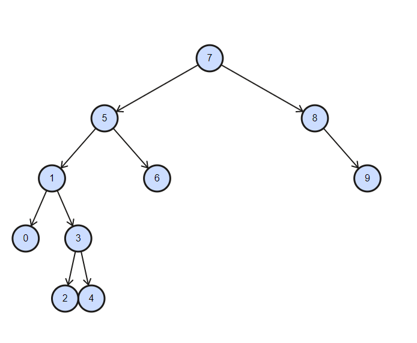

# Proje 3

**[7, 5, 1, 8, 3, 6, 0, 9, 4, 2]** dizisinin Binary-Search-Tree aşamalarını yazınız.

**Örnek:**  root x'dir. root'un sağından y bulunur. Solunda z bulunur vb.

---

 

*Example:* **Find -> 3**

 - Root is 7
 - 3 is smaller than 7, go to left
 - 3 is smaller than 5, go to left
 - 3 is bigger than 1, go to right
 - we found 3